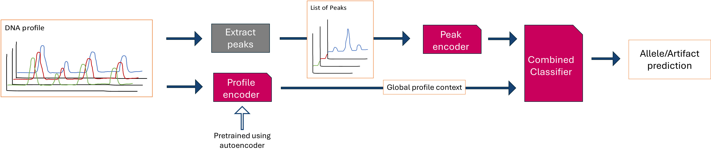

# Model Architectures

All model architectures are pure `nn.Module` classes in `dnanet/models/`.
They contain no training logic — that lives in Lightning modules
(`dnanet/modules/`).

## U-Net (`dnanet.models.unet.UNet`)

The primary segmentation model. Produces a binary mask predicting which
scan points belong to allele peaks.

**Input:** `(batch, 1, num_dyes, signal_length)` = `(B, 1, 5, 4096)`
**Output:** `(batch, 1, num_dyes, signal_length)` — sigmoid probabilities

**Key design choice:** Pooling and upsampling operate only along the
signal-length axis (width), not along the dye axis (height). This preserves
the dye-channel dimension while capturing multi-scale signal patterns.

### Architecture

```
Input (1, 5, 4096)
  │
  ├── Encoder Block 1: DoubleConv(1→32) + MaxPool(1,2)    → (32, 5, 2048)
  ├── Encoder Block 2: DoubleConv(32→64) + MaxPool(1,2)   → (64, 5, 1024)
  ├── Encoder Block 3: DoubleConv(64→128) + MaxPool(1,2)  → (128, 5, 512)
  ├── Encoder Block 4: DoubleConv(128→256) + MaxPool(1,2) → (256, 5, 256)
  │
  ├── Bottleneck: DoubleConv(256→512)                      → (512, 5, 256)
  │
  ├── Decoder Block 4: Upsample + Cat + DoubleConv(512→256) → (256, 5, 512)
  ├── Decoder Block 3: Upsample + Cat + DoubleConv(256→128) → (128, 5, 1024)
  ├── Decoder Block 2: Upsample + Cat + DoubleConv(128→64)  → (64, 5, 2048)
  ├── Decoder Block 1: Upsample + Cat + DoubleConv(64→32)   → (32, 5, 4096)
  │
  └── Final Conv: 1x1 conv(32→1) + Sigmoid                → (1, 5, 4096)
```

### Parameters

| Parameter | Default | Description |
|-----------|---------|-------------|
| `depth` | 4 | Number of encoder/decoder levels |
| `kernel_size` | `(3, 5)` | Convolution kernel (height, width) |
| `num_filters` | 32 | Base filter count (doubles per level) |

## Autoencoders (`dnanet.models.autoencoder`)

Autoencoders learn a compact representation of the full electropherogram.
That representation is later reused by PeakNet as global context for
peak classification, so the main value is the encoder, not only the
reconstruction.

### Conv1dAutoencoder

Processes all dye channels jointly with one 1D CNN encoder/decoder.
Use this when you want a single latent code that can mix information
across dyes.

**Input:** `(batch, dyes, signal_length)`
**Output:** same shape as input

Common parameters for the trainable 1D CNN autoencoders:

| Parameter | Default | Description |
|-----------|---------|-------------|
| `in_channels` | 5 | Number of dye channels |
| `input_length` | 4096 | Scan points per dye |
| `depth` | 5 | Encoder/decoder depth |
| `compression` | 8 | Target compression ratio |

### PerDyeConv1dAutoencoder

Runs a separate 1D autoencoder per dye channel and concatenates the
encoded outputs. This is the default PeakNet autoencoder because it
preserves dye-specific structure while still producing a compact global
representation.

### SharedWeightPerDyeConv1dAutoencoder

Like the per-dye model, but all dye channels share the same weights.
This reduces parameter count while keeping channels separate.

### UNet2DAutoEncoder

Processes the electropherogram as a full 2D image with a U-Net-style
encoder and decoder. Use this when information across dye channels is
important and you want the latent representation to retain both local
detail and broader image-level context.

### FourierAutoencoder

Non-learned baseline that compresses each signal in the frequency domain.
Useful for comparing learned encoders against a simple fixed transform.

## Peak Classifier (`dnanet.models.peak_classifier`)

Classifies extracted peak windows. In the default setup this is a binary
allele-versus-artefact model, but the output size is configurable.

The model uses a 1D CNN because the useful evidence is local peak shape
along the scan axis. It can also take a marker index embedding so one
model can adapt to locus-specific behaviour without separate per-marker
networks.

This model is used both as a standalone classifier and as the local branch
inside PeakNet.

**Input:** `(batch, channels, width)` peak windows, optionally with marker indices
**Output:** class logits per peak

| Parameter | Default | Description |
|-----------|---------|-------------|
| `width` | 120 | Peak window width |
| `n_markers` | 28 | Size of the marker embedding table |
| `embedding_dim` | 8 | Marker embedding size |
| `hidden_channels` | `[32, 64]` | Conv channel sizes |
| `pooling` | `flat` | Feature pooling strategy |

## Combined Classifier (`dnanet.models.peaknet`)


PeakNet combines local peak features from the peak classifier with global
profile features from an autoencoder encoder. It predicts a class for each
detected peak and writes those predictions back into a segmentation-shaped
output tensor so it can train against segmentation-style annotations.

### Combiner Types

- **MLP** — default and simplest option; concatenates local and global features
- **FiLM** — global context modulates local peak features
- **CrossAttention** — peaks attend to the encoded profile representation

## Loss Functions (`dnanet.models.loss`)

### DiceLoss

Dice coefficient loss for binary segmentation. Handles class imbalance
naturally (allele peaks are sparse in the signal).

```python
loss = 1 - (2 * |pred ∩ target| + smooth) / (|pred| + |target| + smooth)
```

### FocalLoss

Focuses training on hard examples by down-weighting well-classified samples.
Used for classification tasks.

```python
loss = -α * (1 - p_t)^γ * log(p_t)
```

| Parameter | Default | Description |
|-----------|---------|-------------|
| `alpha` | 0.25 | Balancing factor |
| `gamma` | 2.0 | Focusing parameter |
